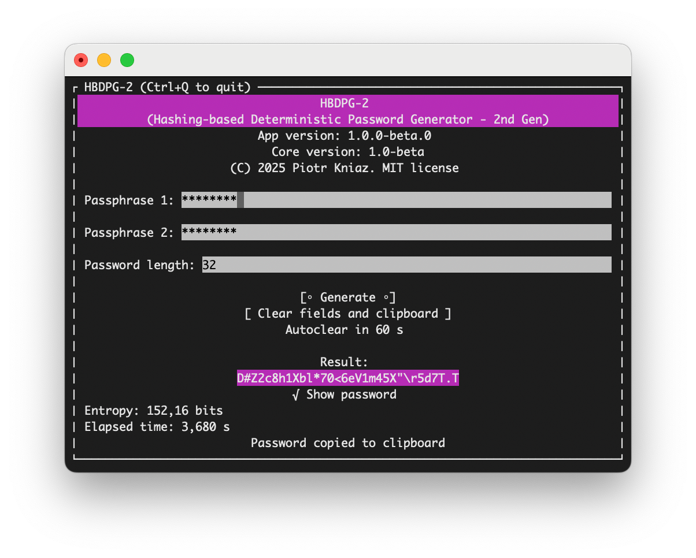

# HBDPG-2 (Text-based UI)

## Contents

- [About](#about)
- [Risks and Recommendations](#risks-and-recommendations)
- [Feedback](#feedback)
- [Credits](#credits)

## About

**HBDPG-2 (TUI edition)** is an open-source, cross-platform deterministic password generator for Terminal running on *.NET Runtime*. It is **3-4 times faster** than the [web version](https://hbdpg-2.github.io), but only supports Windows and macOS.

More detailed information can be found in the [main project repository](https://github.com/HBDPG-2/hbdpg-2.github.io).

## Risks and Recommendations

The main risk of using HBDPG-2 is the ability of an attacker to brute-force simple and popular passphrases to find out your password.

**Do not use weak and short passphrases!** For optimal security, use **two distinct passphrases**. This helps ensure that even if one passphrase is compromised, your generated password remain secure. Try to choose phrases that are memorable but unique to you.

**Do not use HBDPG-2 on untrusted or compromised devices!**

**Do not store passphrases or passwords in plain text!** If you want to save them, use password managers or encrypt them manually (e.g. with AES).

**Use unique passwords for each account.**

**Use 2FA (MFA)** on all accounts whenever possible!

## Feedback

If you find a bug, you can report it on [this page](https://github.com/HBDPG-2/hbdpg-2-tui/issues).

If you have discovered a vulnerability, please read the [Security Policy](https://github.com/HBDPG-2/hbdpg-2-tui/security/policy) and report the issue **privately!**

## Credits

**Main Developer:** [Piotr Kniaz](https://github.com/Piotr-Kniaz)

**Used Resources:**

- [Konscious.Security.Cryptography.Argon2](https://github.com/kmaragon/Konscious.Security.Cryptography) by Keef Aragon (v1.3.1)
- [Terminal.Gui](https://github.com/gui-cs/Terminal.Gui) by gui-cs (v1.18.1)
<!-- - [TextCopy](https://github.com/CopyText/TextCopy) by Simon Cropp (v6.2.1) -->

---

<a href="https://github.com/HBDPG-2/hbdpg-2-tui/blob/master/LICENSE">MIT License</a>

© 2025 Piotr Kniaz
